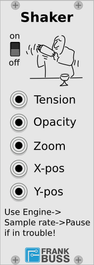
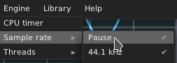

# Shaker

Shake your Rack. This module can modulate the cable tension, opacity, the
zoom factor and the scroll position of your rack.

### Tension
This input has a range from 0 V to 10 V and changes the cable tension
from 0 to 1.

### Opacity
The opacity input has the same range from 0 V to 10 V and changes teh cable
opacity from 0 % to 100%.

### Zoom
The zoom input has a range from -10 V to +10 V. This is scaled down
to the range -2 to +2. The formula used by Rack to calculate the
zoom factor is 2^n. So for an input voltage of 0 V, the zoom factor
is 1, or 100%. For -2 it is 25% and for +4 it is 400%.

If your rack is zooming like crazy and you can't stop it, go to the
menu `Engine->Sample Rate->Pause`:
	

